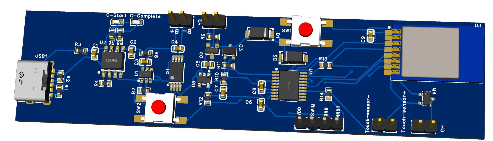

# BlazePod Trainer — Wireless Reaction Training Pod

A custom PCB design for a wireless reaction-training pod (BlazePod-style device), built around an STM8S microcontroller and a 2.4GHz wireless radio module, with full Li-ion battery charging and protection circuitry.

## Overview

This board is a compact, battery-powered training pod: a capacitive touch surface triggers an event, the microcontroller processes it, and a 2.4GHz radio link communicates with other pods or a base station — the same basic architecture used in commercial reaction-training and agility products. The design integrates power management, wireless communication, and touch sensing into a single small-form-factor board.

**Full schematic:** [Blazepod_schematics.pdf](Blazepod_schematics.pdf)
**Bill of Materials:** [BOM.xlsx](BOM.xlsx)

## Key Specs

| Subsystem | Part | Notes |
|---|---|---|
| MCU | STM8S003F3P6 | 8-bit core, SWIM debug interface, drives touch input & radio |
| Wireless | E01-ML01S (nRF24L01+ based) | SPI-controlled 2.4GHz transceiver |
| Charging | TP4056 | Linear Li-ion charge management |
| Protection | DW01A + FS8205A | Overcharge / overdischarge / overcurrent protection |
| Regulation | AP2112K-3.3 | Fixed 3.3V LDO for MCU and radio rail |
| Power switch | AO3401A / AO3400A | Soft-latch power circuit (single-button on/off) |
| Input | USB Type-C | Charging input |
| Sensing | Capacitive touch header | External touch sensor pads |

## Design Highlights

- **Soft-latch power switching** — a single tactile button (SW1) toggles power on/off via a P/N-MOSFET pair (Q2/Q3) instead of a mechanical power switch, common in modern battery-powered wearables.
- **Battery protection stack** — DW01A protection IC paired with an FS8205A dual-MOSFET handles overcurrent, overcharge, and overdischarge conditions independently of the charger IC.
- **USB-C power input** — uses the CC1/CC2 lines for basic Type-C power negotiation into the TP4056 charge path.
- **SWIM programming header** — exposes VDD/SWIM/GND/NRST for direct in-circuit programming and debugging of the STM8S003.
- **Capacitive touch input** — dedicated header and BC847 conditioning transistor for an external touch sensor, decoupled from the main board.

## Author

Designed by Priyanshu Dubey. Reviewed by Vinay Chaddha.

